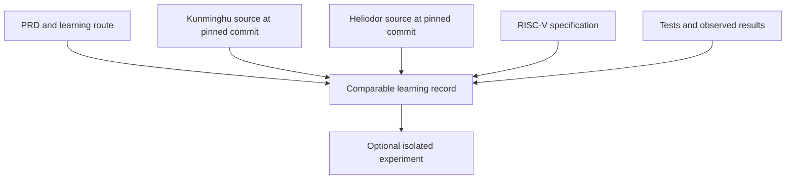

# 学习证据流

```mermaid
flowchart TD
  P[PRD and learning route] --> N[Comparable learning record]
  S1[Kunminghu source at pinned commit] --> N
  S2[Heliodor source at pinned commit] --> N
  ISA[RISC-V specification] --> N
  T[Tests and observed results] --> N
  N --> E[Optional isolated experiment]
```
